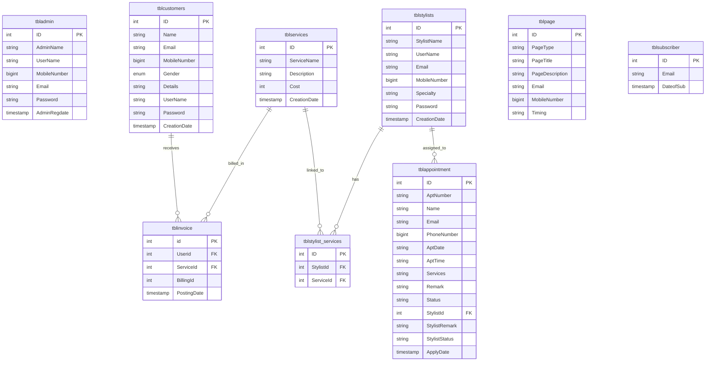
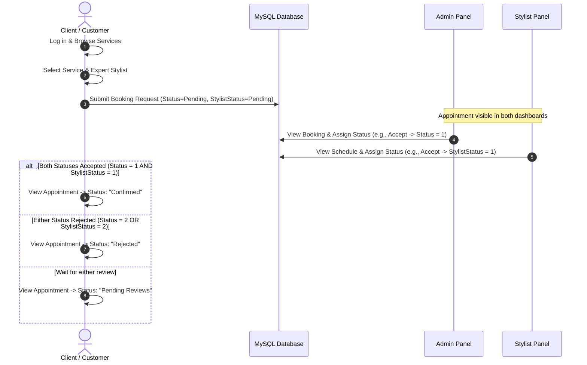

# Online Saloon Management System (MSMS)
## Software Engineering Project Report & Documentation

---

### Table of Contents
1. [Project Abstract](#1-project-abstract)
2. [Introduction & Problem Statement](#2-introduction--problem-statement)
3. [Technology Stack](#3-technology-stack)
4. [System Architecture & Modules](#4-system-architecture--modules)
5. [Database Design & Schema Analysis](#5-database-design--schema-analysis)
6. [Mermaid System Diagrams](#6-mermaid-system-diagrams)
7. [Installation & Configuration Guide](#7-installation--configuration-guide)
8. [System Features & Visual Output Walkthrough](#8-system-features--visual-output-walkthrough)
9. [Conclusion & Future Enhancements](#9-conclusion--future-enhancements)

---

### 1. Project Abstract
The **Online Saloon Management System (MSMS)** is a web-based application designed to streamline and automate the operations of a modern hair saloon. Traditionally, saloons operate on manual appointment scheduling, paper-based billing, and unstructured customer tracking, leading to long customer wait times and operational inefficiencies. MSMS digitizes these processes by offering a unified portal for three primary user roles: **Administrators**, **Clients (Customers)**, and **Stylists (Barbers/Hairdressers)**. 

Through this system, clients can register accounts, browse services, select qualified stylists based on specialty, and request appointments. Stylists can manage their daily schedules and accept or reject requests, while administrators exercise full oversight, managing services, staff, billing, generating invoices, and viewing comprehensive sales reports.

---

### 2. Introduction & Problem Statement
In the service-oriented beauty and grooming industry, client experience is paramount. However, traditional saloons face several challenges:
- **Inefficient Appointment Scheduling:** Customers must call or visit to book appointments, leading to phone congestion or double-booking.
- **Underutilized Staff (Stylists):** Lacking a direct schedule, stylists cannot manage their work queues or showcase their specific service expertise.
- **Complex Billing & Invoicing:** Calculating bills manually for multiple services can lead to errors and lacks professional record-keeping.
- **Lack of Business Insights:** Administrators struggle to get data on daily, weekly, or monthly sales and service popularity.

#### Objectives
The Online Saloon Management System aims to solve these problems by:
1. Providing a user-friendly, responsive booking form that matches services to stylist expertise.
2. Implementing a decentralized workflow where both admins and stylists verify booking availability.
3. Automating invoice generation and record maintenance.
4. Supplying visual dashboards and detailed reporting metrics for salon managers.

---

### 3. Technology Stack
The application is built using a robust open-source LAMP/WAMP stack:
* **Frontend:** HTML5, CSS3, JavaScript, jQuery, Bootstrap framework (responsive UI layout).
* **Backend:** PHP (Hypertext Preprocessor) for server-side logic and database connectivity.
* **Database:** MySQL/MariaDB for relational database management.
* **Server Environment:** Apache HTTP Server (typically run via WAMP, XAMPP, or MAMP local environments).
* **Authentication:** Password security backed by MD5 hashing.

---

### 4. System Architecture & Modules

The application is structured into four distinct modules:

```
                  ┌─────────────────────────────────────────┐
                  │              Public Website             │
                  │   - Home Page      - Service Showcase   │
                  │   - About & Hours  - Contact Inquiries  │
                  └────────────────────┬────────────────────┘
                                       │
                                       ▼
        ┌─────────────────────────────────────────────────────────────┐
        │                 Relational Database (MySQL)                 │
        │                  Table Schemas & Relations                  │
        └───────┬──────────────────────┬──────────────────────┬───────┘
                │                      │                      │
                ▼                      ▼                      ▼
    ┌──────────────────────┐┌──────────────────────┐┌──────────────────────┐
    │     Client Panel     ││    Stylist Panel     ││     Admin Panel      │
    │ - Self-Registration  ││ - Assign Schedules   ││ - Manage Services    │
    │ - Book Appointments  ││ - Respond to Bookings││ - Manage Stylists    │
    │ - Select Stylists    ││ - Update Profile     ││ - Appointment Control│
    │ - Track Status       ││                      ││ - Billing & Invoices │
    │ - View Invoices      ││                      ││ - Sales Reports      │
    └──────────────────────┘└──────────────────────┘└──────────────────────┘
```

#### A. Public Portal (Visitor Interface)
- **Home & Information:** Displays salon operational hours, contact details, and location.
- **Service List:** Interactive pricing table displaying available haircut, styling, and facial treatments.
- **Contact Form:** Allows non-registered users to send feedback or inquiries to the database.

#### B. Client (Customer) Portal
- **Dashboard:** Visual summary of appointment statistics and invoices.
- **Self-Booking Engine:** Advanced form allowing customers to select a desired service, choose a stylist specializing in that service, and pick a custom date and time.
- **My Appointments:** Real-time dashboard showing the approval progress (Admin status and Stylist status).
- **Invoice Center:** Detailed digital receipt tracking and lookup.

#### C. Stylist Portal
- **Personal Dashboard:** Summary of assigned customer bookings.
- **Schedule Management:** List of incoming customer requests requesting their service. Stylists can view details, add remarks, and mark bookings as "Accepted" or "Rejected".
- **Stylist Profile:** Edit contact details and specialty details.

#### D. Admin Dashboard
- **Dashboard Metrics:** Aggregates statistics including Total Customers, Total Appointments, Accepted Bookings, Rejected Bookings, Services Offered, and Today’s/Yesterday's Sales.
- **Service Catalog:** Full CRUD operations (Create, Read, Update, Delete) on salon service lists and pricing.
- **Stylist Management:** Create stylist profiles and manage expertise mapping (linking stylists to specific services).
- **Appointment Processing:** Comprehensive tracking of all booking applications, adding admin remarks, and finalizing approval.
- **Customer Billing:** Select customer accounts, choose rendered services, and instantly generate print-ready, formatted invoices.
- **Analytical Reporting:** Sales metrics and customer lists filterable by customized date intervals.

---

### 5. Database Design & Schema Analysis
The system uses MySQL database `msmsdb` with nine tables configured with primary keys and relational linkages:

#### 1. `tbladmin`
Stores system administrator login details.
* **`ID`** (int(10), Primary Key, Auto-Increment)
* **`AdminName`** (char(50)): Name of the administrator.
* **`UserName`** (char(50)): Login username (Default: `admin`).
* **`MobileNumber`** (bigint(10)): Admin contact number.
* **`Email`** (varchar(200)): Admin email address.
* **`Password`** (varchar(200)): MD5 hashed password.
* **`AdminRegdate`** (timestamp): Account registration date.

#### 2. `tblcustomers`
Stores registered customer data.
* **`ID`** (int(10), Primary Key, Auto-Increment)
* **`Name`** (varchar(120)): Customer's name.
* **`Email`** (varchar(200)): Email address.
* **`MobileNumber`** (bigint(11)): Contact number.
* **`Gender`** (enum('Female','Male','Transgender')): Gender classification.
* **`Details`** (mediumtext): Special notes or booking remarks.
* **`UserName`** (varchar(100)): Login username.
* **`Password`** (varchar(200)): MD5 hashed password.
* **`CreationDate`** (timestamp): Account creation timestamp.
* **`UpdationDate`** (timestamp): Modification timestamp.

#### 3. `tblstylists`
Stores stylist information and authentication details.
* **`ID`** (int(10), Primary Key, Auto-Increment)
* **`StylistName`** (varchar(120)): Stylist's full name.
* **`UserName`** (varchar(100)): Login username (Default: `stylist`).
* **`Email`** (varchar(200)): Work email.
* **`MobileNumber`** (bigint(11)): Work contact number.
* **`Specialty`** (varchar(200)): General description of expertise.
* **`Password`** (varchar(200)): MD5 hashed password.
* **`CreationDate`** (timestamp): Account creation timestamp.

#### 4. `tblservices`
Lists services offered by the salon.
* **`ID`** (int(10), Primary Key, Auto-Increment)
* **`ServiceName`** (varchar(200)): Title of the service (e.g., "Hair Cut", "Fruit Facial").
* **`Description`** (mediumtext): Detailed breakdown of the service.
* **`Cost`** (int(10)): Cost of the service.
* **`CreationDate`** (timestamp): Insertion timestamp.

#### 5. `tblstylist_services`
Maps stylists to services they are expert in (Many-to-Many join table).
* **`ID`** (int(10), Primary Key, Auto-Increment)
* **`StylistId`** (int(10)): Links to `tblstylists(ID)`.
* **`ServiceId`** (int(10)): Links to `tblservices(ID)`.
* *Constraint:* Unique key composite (`StylistId`, `ServiceId`).

#### 6. `tblappointment`
Tracks customer appointments, scheduling, and approval states.
* **`ID`** (int(10), Primary Key, Auto-Increment)
* **`AptNumber`** (varchar(80)): Unique auto-generated booking number.
* **`Name`** (varchar(120)): Client name.
* **`Email`** (varchar(120)): Client email.
* **`PhoneNumber`** (bigint(11)): Client phone.
* **`AptDate`** (varchar(120)): Scheduled date.
* **`AptTime`** (varchar(120)): Scheduled time.
* **`Services`** (varchar(120)): Selected service.
* **`ApplyDate`** (timestamp): Submission timestamp.
* **`Remark`** (varchar(250)): Admin response notes.
* **`Status`** (varchar(50)): Admin approval status (`1` = Accepted, `2` = Rejected, empty = Pending).
* **`StylistId`** (int(10)): Requested stylist ID (Links to `tblstylists(ID)`).
* **`StylistRemark`** (varchar(250)): Stylist feedback notes.
* **`StylistStatus`** (varchar(10)): Stylist approval status (`1` = Accepted, `2` = Rejected, empty = Pending).
* **`RemarkDate`** (timestamp): Admin status update timestamp.

#### 7. `tblinvoice`
Tracks billing invoices generated by administrators.
* **`id`** (int(11), Primary Key, Auto-Increment)
* **`Userid`** (int(11)): Customer ID (Links to `tblcustomers(ID)`).
* **`ServiceId`** (int(11)): Rendered service ID (Links to `tblservices(ID)`).
* **`BillingId`** (int(11)): Global invoice ID (grouped for multi-service receipts).
* **`PostingDate`** (timestamp): Billing date.

#### 8. `tblpage`
Maintains customizable static contents for CMS pages (About Us, Contact Us).
* **`ID`** (int(10), Primary Key, Auto-Increment)
* **`PageType`** (varchar(200)): Page identifier (`aboutus` or `contactus`).
* **`PageTitle`** (mediumtext): Page header.
* **`PageDescription`** (mediumtext): HTML content markup of the page.
* **`Email`** (varchar(200)): Contact email details.
* **`MobileNumber`** (bigint(10)): Salon contact number.
* **`Timing`** (varchar(200)): Opening hours (e.g., "10:30 am to 8:30 pm").
* **`UpdationDate`** (date): Last modified date.

#### 9. `tblsubscriber`
Stores subscription emails from newsletters.
* **`ID`** (int(5), Primary Key, Auto-Increment)
* **`Email`** (varchar(200)): Subscriber email.
* **`DateofSub`** (timestamp): Subscription timestamp.

---

### 6. Mermaid System Diagrams

> [!TIP]
> **Interactive Database Viewer:** An interactive visual representation of the saloon's database has been created in [database_diagram.html](file:///c:/wamp64/www/Online-Saloon-Management-system-main/database_diagram.html). Open this file in your browser to interactively zoom, pan, search columns/tables, inspect table details, copy SQL code, and toggle between Chen Notation and Relational (Crow's Foot) Notation.

#### A. Entity-Relationship Diagram (ERD)



#### B. Appointment Workflow Sequence Diagram

This diagram demonstrates the dual-approval workflow. A booking is fully confirmed only if both the Admin and the selected Stylist accept.



---

### 7. Installation & Configuration Guide

Follow these steps to set up and run MSMS on your local server.

#### Prerequisites
- WampServer (Recommended), XAMPP, or MAMP installed on Windows/macOS.
- Web Browser (Chrome, Edge, Firefox).

#### Installation Steps
1. **Move Codebase:** Copy the folder `Online-Saloon-Management-system-main` and paste it inside your server's root directory:
   - For WampServer: `C:\wamp64\www\`
   - For XAMPP: `C:\xampp\htdocs\`
2. **Database Import:**
   - Open WampServer/XAMPP, start Apache and MySQL.
   - Go to `http://localhost/phpmyadmin/`.
   - Create a new database named **`msmsdb`**.
   - Click the **Import** tab.
   - Click "Choose File" and select `SQL File/msmsdb.sql`. Click **Go**.
3. **Database Schema Updates:**
   - Run the updates in order to configure the Client Login and Stylist functions.
   - Open the **SQL** tab in phpMyAdmin under `msmsdb` database.
   - Open and copy the SQL code from `SQL File/client_auth_update.sql`, paste it in phpMyAdmin and execute.
   - Next, open, copy, and run `SQL File/stylist_panel_update.sql`.
   - Finally, open, copy, and run `SQL File/stylist_booking_update.sql`.
   *(If you encounter any column duplication warnings, run `SQL File/fix_stylist_columns.sql` to align the columns).*
4. **Database Configuration:**
   - Open `includes/dbconnection.php` in a code editor.
   - Ensure the server connection credentials match your setup:
     ```php
     $con=mysqli_connect("localhost", "root", "", "msmsdb");
     ```
     *(Add your MySQL password if you configured phpMyAdmin with a root password).*
5. **Open in Browser:**
   - Client and Booking Portal: `http://localhost/Online-Saloon-Management-system-main/`
   - Admin Login page: Direct path at `http://localhost/Online-Saloon-Management-system-main/admin/`

#### Demo Credentials

| Role | Username | Password | Dashboard File |
| :--- | :--- | :--- | :--- |
| **Administrator** | `admin` | *(Defined on import / original admin pass)* | `admin/dashboard.php` |
| **Stylist** | `stylist` | `stylist123` | `stylist/dashboard.php` |
| **Client (User)** | `manish` | `client123` | `client/dashboard.php` |
| **Client (User)** | `rahul` | `client123` | `client/dashboard.php` |

---

### 8. System Features & Visual Output Walkthrough

Here is a guide to the project modules accompanied by the screenshots from the `WORKING IMAGES/` directory:

#### Step 1: Database Initialization
* **Database Setup (`Screenshot 1.png`):** Imported the database `msmsdb` via phpMyAdmin interface on Localhost Server (`127.0.0.1`).
* **Table Schema Overview (`Screenshot 2.png` & `Screenshot 3.png`):** The schema consists of 7 base tables (`tbladmin`, `tblappointment`, `tblcustomers`, `tblinvoice`, `tblpage`, `tblservices`, `tblsubscriber`) which expand to 9 tables with the stylist panels, organizing structural relations.

#### Step 2: Customer Navigation & Appointment Request
* **Browsing Salon Services (`Screenshot 11.png`):** Guests can view the service catalog. Prices (e.g. O3 Facial at \$120, Deluxe Pedicure at \$600) and exfoliating properties are displayed.
* **Booking Form (`Screenshot 10.png`):** A client registers, signs in, and selects a service. They fill out Name, Phone, Email, date, time, and specify an expert stylist.

#### Step 3: Admin & Stylist Dashboard Controls
* **Admin Login Screen (`Screenshot 4.png`):** The secure entryway for saloon administrators.
* **Admin Statistics Console (`Screenshot 5.png`):** The landing dashboard shows real-time analytics. Total Customers (5), Total Appointments (11), Accepted (6), Rejected (6), and total services (17) are calculated.
* **Services Management (`Screenshot 9.png`):** Admins can update current services and input costs using the Add Services screen.
* **Subscribers (`Screenshot 7.png`):** Admins view marketing leads and newsletter emails registered from the website footer.

#### Step 4: Verification, Scheduling, & Billing
* **Accepted Appointment List (`Screenshot 6.png`):** View details of bookings accepted by the admin.
* **Invoices & Billing Panel (`Screenshot 8.png`):** When services are rendered, the admin generates a combined invoice. For example, Client `Test user` billed for a "Normal Pedicure" (\$400) and "Style Haircut" (\$550) yields a Grand Total of \$950. The page features an automated print button for paper receipt printing.

---

### 9. Conclusion & Future Enhancements

The **Online Saloon Management System** achieves its core goal of digitizing saloon operations. It increases customer convenience through self-booking, minimizes business workload with structured dashboard pipelines, organizes stylist queues, and automates paperless invoice generation.

#### Future Scope
To make the application more robust, the following modules can be added:
1. **Online Payment Gateway Integration:** Incorporating Stripe, PayPal, or UPI API for booking deposits and digital payments.
2. **Automated SMS & Email Reminders:** Using Twilio API or PHPMailer to send reminder alerts to clients 1 hour before their appointment.
3. **Advanced Stylist Analytics:** Adding ranking algorithms, client reviews/ratings for stylists, and visual stylist performance charts for administrators.
4. **Interactive Seating / Slot Map:** Real-time visual representation of occupied/available seats or chairs in the saloon.
